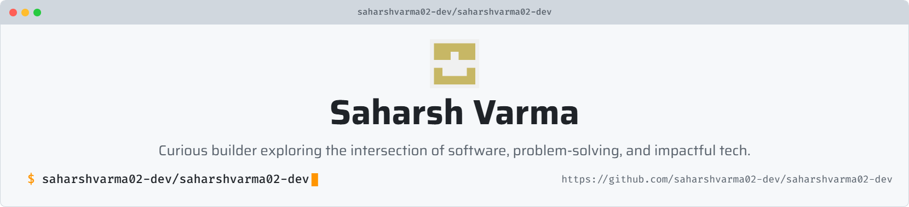

<picture>
   <source media="(prefers-color-scheme: dark)" srcset="art/header-dark.png">
   <source media="(prefers-color-scheme: light)" srcset="art/header-light.png">
   
</picture>

## Hi there 👋

- 🎓 Computer Science student at Guru Gobind Singh Indraprastha University.
- 💻 Passionate about Software Development, Machine Learning and Robotics.
- 🚀 Building AI-powered projects and contributing to Open Source Softwares.
- ✨ Always chasing the next idea worth building.

## 🌐 Socials:
  

# 💻 Tech Stack:
                                  
# 📊 GitHub Stats:
 
 

### ✍️ Random Dev Quote

---

<!-- Proudly created with GPRM ( https://gprm.itsvg.in ) -->
